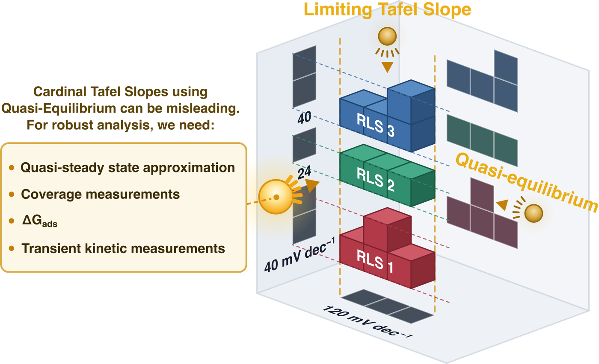

# Microkinetic simulation of multistep electrochemical reactions



This repository contains scripts that can run microkinetic simulations of an
electrocatalytic mechanism. Each script runs the method specified in its name.
In each script, the mechanism is defined inline in a `MECHANISM` block you
edit, so the same code runs HER, HOR, ORR, OER, or any custom mechanism.

## Installation

```
pip install -r requirements.txt
```

installs everything (numpy, scipy, matplotlib, jupyter); numpy and scipy alone
suffice for the scripts without plotting.

| script | method | needs |
|---|---|---|
| `numerical.py` | stiff ODE integration of the coverage equations to steady state | numpy, scipy |
| `qssa.py` | quasi-steady-state approximation (solve `N·v = 0` algebraically) | numpy, scipy |
| `gillespie.py` | stochastic simulation (Gillespie Monte Carlo) on a finite site ensemble | numpy |
| `transient.py` | potentiostatic current transient `i(t)` after a potential step (companion to `numerical.py`) | numpy, scipy |

`io_plot.py` is a shared helper (imported by the four scripts) that writes the
CSV and draws the plots; it is not run directly. Run the scripts from the
repository directory so the import resolves, e.g. `python numerical.py`.
`numerical.py`, `qssa.py`, and `gillespie.py` each print the current density and
surface coverages across a scan of overpotentials. `numerical.py` and `qssa.py`
also report the local Tafel slope. `transient.py` instead prints the current
versus time after a step to a fixed overpotential, sampled over whatever window
and resolution you choose.

## Output: CSV and plots

Each script has two output controls in its config block:

- `CSV_OUT` — filename for a CSV of the results (`None` to skip). Uses only the
  standard library.
- `SHOW_PLOT` — if `True`, opens a plot window: `|j|` versus overpotential for
  the three scan scripts (with error bars for `gillespie.py`), or `i(t)` for
  `transient.py`. Plotting needs `matplotlib`.

## Tutorials

The `tutorials/` folder contains one Jupyter notebook per reaction in the main text,
each walking through all of the methods on that reaction's mechanism and then
rebuilding the paper's designed rate-limiting-step cases:

| notebook | reaction |
|---|---|
| `01_HER.ipynb` | acid HER (Volmer–Heyrovsky–Tafel) |
| `02_HOR.ipynb` | HOR (anodic branch of the same mechanism) |
| `03_ORR.ipynb` | acid associative 4-e⁻ ORR (5 steps) |
| `04_OER.ipynb` | alkaline associative 4-e⁻ OER (5 steps) |

They are supported by two modules in the same folder: `tutorials/core.py` and `tutorials/mechanisms.py`.
Run the notebooks from the `tutorials/` folder. They need `numpy`, `scipy`, and `matplotlib`.

## Defining a mechanism

Edit the `MECHANISM` block near the top of each script:

- `SPECIES` — surface species, including the free site named in `SITE`.
- `STEPS` — each step gives its surface `reactants`/`products` with
  stoichiometric coefficients (a coefficient of `2` is a bimolecular term),
  `n_e` electrons transferred (`0` for a chemical step), symmetry factor `beta`,
  standard rate constants `k0`/`km0`, and optional bulk activities `a_fwd`/`a_rev`.
- `DIRECTION` — `-1` for a cathodic reaction (HER, ORR), `+1` for anodic (HOR, OER).
- `ETAS` — the overpotentials to scan (`STEP_ETAS`, `T_END`, and `N_T` set the
  potentials, time window, and sampling for `transient.py`).

The default mechanism is acid HER (Volmer–Heyrovsky–Tafel).

## Citing

See `CITATION.cff` for citation details.
